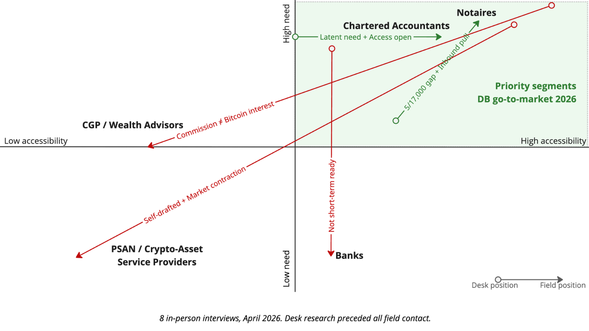
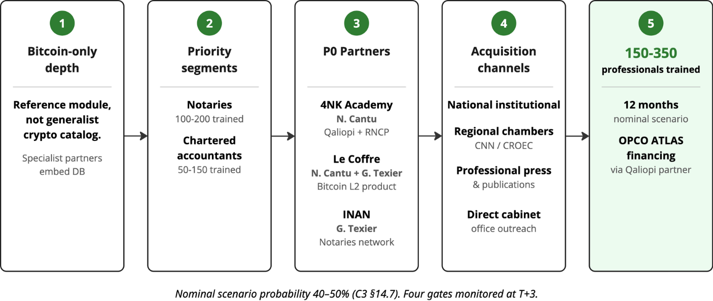

# B2B Go-to-Market Strategy for Découvre Bitcoin

**Plan B Academy · Bitcoin Business Track · Manuel Proquin · April 2026**  
**Access** — [full web version](https://man-orangepeel.github.io/DB-B2B-GTM-Strategy-2026/) (report · companion files · appendices) · [GitHub source](https://github.com/man-orangepeel/DB-B2B-GTM-Strategy-2026)

---

## Executive Summary

*Is there a viable B2B training market for Bitcoin in France — and how to enter it?*

### What field interviews changed

<table class="verdict-table">
<thead>
<tr><th>Desk</th><th>Segment</th><th>Field verdict</th><th>Anchor citation</th><th>Retained?</th></tr>
</thead>
<tbody>
<tr><td>#1</td><td>CGP (33/40)</td><td>Commission model blocks Bitcoin interest</td><td><em>« the hardest target there is »</em> — LAF</td><td>❌</td></tr>
<tr class="retained"><td>#2</td><td><strong>Notaires</strong> (30/40)</td><td>Responsive, gap measurable, institutional channel open</td><td><em>« 5 of 17,000 autonomous »</em> — GT</td><td><strong>✅ Priority 1</strong></td></tr>
<tr><td>#3</td><td>PSAN / CASP (29/40)</td><td>No external training market ; Art. 81 self-drafted</td><td><em>« real barrier = 20–30 % cyber audit »</em> — AG</td><td>❌</td></tr>
<tr><td>#4</td><td>Banks (28/40)</td><td>Bitcoin in Phase 3 of digital-assets roadmap</td><td><em>« Phase 3 »</em> — MD (BNP)</td><td>⏸</td></tr>
<tr class="retained"><td>#5</td><td><strong>Chartered acc.</strong> (27/40)</td><td>Strongest Bitcoin-only validation in corpus</td><td><em>« the natural entry point »</em> — JO</td><td><strong>✅ Priority 2</strong></td></tr>
</tbody>
</table>

Across France's **130,000+ training providers**, none teaches Bitcoin in notarial or accounting practice (Mon Compte Formation 2025). Découvre Bitcoin can own this whitespace by Q2 2027 via a Qualiopi-partner umbrella (4NK Academy), a notary-practitioner co-construction (Gwendal Texier / INAN) and a Bitcoin-native product coupling (Le Coffre). Nominal scenario: **150–350 professionals trained** (100–200 notaires + 50–150 chartered accountants).

### Recommendation — 4 operational moves

- **Seal 3 P0 partnerships by Q3 2026** — 4NK Academy (Qualiopi) · Le Coffre (product) · Gwendal Texier (notary practitioner).
- **Pilot 1 notary chamber by Q4 2026** outside Toulouse / Lyon (Bretagne, Nouvelle-Aquitaine, Pays de la Loire, Grand Est, Hauts-de-France).
- **File campusAtlas 2027 catalog application by Q3 2026** — only institutional door to ~138,000 IDCC 787 salaried accountants before 2028.
- **Secure Rogzy B2B bandwidth ≥ 40% for 12 months** — internal execution constraint, no partner substitute.

### What would kill the plan

Five kill criteria tracked quarterly (detail in § E). Top three: **conversion < 10% at T+6** (need not felt) · **zero Qualiopi partnership signed at T+6** (no institutional scale path) · **pilot NPS < 7 with explicit Bitcoin-only pushback** (positioning itself rejected).

<strong>Schema 1 · Diagnosis — segment ranking reshaped by fieldwork</strong>

2×2 matrix — horizontal axis: segment accessibility (field-measured), vertical axis: training-need intensity (desk research). Arrows show each segment's movement from desk-research position to post-interview position. Notaires and chartered accountants consolidate in the top-right priority quadrant.

<strong>Schema 2 · Recommendation — 12-month GTM sequencing</strong>

Five-block horizontal flow, left to right :

<ol class="schema-caption-list">
<li>Bitcoin-only depth — the reference module, not a generalist crypto catalog.</li>
<li>Two priority segments — notaires and chartered accountants.</li>
<li>Three P0 partners — 4NK Academy (Qualiopi + RNCP), Le Coffre (Bitcoin-native document anchoring), Gwendal Texier / INAN (notarial practitioner network).</li>
<li>Four acquisition channels — national institutional, regional chambers, professional press, direct firm outreach.</li>
<li>150–350 professionals trained in 12 months (nominal scenario, OPCO ATLAS financing via Qualiopi partner).</li>
</ol>

---

## A · Market state before fieldwork

### A.1 Segment-first approach

The client's scope (« institutions, schools, governments, individuals with professional objectives ») mixes buyer types and channels. A market segment is defined by a shared professional problem — a notarial school is a channel to reach the **Notaires** segment, not a segment itself. Three criteria back the segment-first choice:

- **Value proposition, pricing and sales cycle vary by segment**, not by organisation type — a channel-first approach would blur pricing anchors across heterogeneous buyer categories.
- **Practising professionals have a documented problem today** (DAC8, ANC 2026-01, client pressure) — students and apprentices do not yet.
- **Financing mechanisms are structurally segment-linked** (OPCO ATLAS for the financial-services branch, FIFPL for libéraux, own-cabinet budget for TPEs) — a channel-first frame would misalign with the actual funding circuit.

### A.2 Regulatory context

Four regulatory pillars shape potential demand:

- **MiCA** (Regulation (EU) 2023/1114) — imposes a « fit and proper » competence regime on crypto-asset service providers via Art. 81 (ESMA Guidelines 11/07/2025: 80 h initial + 10-15 h CPD/yr).
- **DAC8** (Directive (EU) 2023/2225, in force since 01/01/2026) — mandates annual crypto-transaction reporting by intermediaries, first filing 2027.
- **ANC 2026-01** (published 09/01/2026, mandatory from accounting years opening 01/01/2027) — first comprehensive French crypto-accounting standard.
- **Continuing-education obligations** — French notaires 20 h/yr (Decree 2011-1230) · chartered accountants 120 h / 3 yr DPC.

No mapped training provider addresses DAC8 frontally as of April 2026.

### A.3 Training financing

France registered **130,000+ training providers** in 2025 (Mon Compte Formation / DGEFP) — none dedicated to Bitcoin for notaires and chartered accountants. Qualiopi certification is the access key: without it, no OPCO, FIFPL, AGEFICE or CPF funding is accessible. Relevant finance channels for the target segments:

- **OPCO ATLAS PDC TPE** — up to €20,000 per trainee, requires a Qualiopi partner.
- **Own cabinet budget** — direct sale, no condition.
- **FIFPL** — liberal professionals, cap €900/yr, requires Qualiopi.
- **AGEFICE** — TNS managers, €900–2,100/training, requires Qualiopi.

**CPF is out of scope** for B2B professional finance training: 5–10 % of sales at best (Murielle Macadam confirmed), administrative burden disproportionate (Nicolas Cantu).

### A.4 Six segments scored desk (pre-field)

Eight-criteria grid on 40 points. Four mission criteria: M1 size, M2 training-need intensity, M3 accessibility, M4 funding mechanisms. Four complementary: C1 MiCA urgency, C2 end-client demand, C3 contract value, C4 DB Bitcoin-only alignment. Desk Top 5 *before field research* — subsequently revised in Part B:

| Pre-field rank | Segment | Score | Rationale |
|:-:|---|:-:|---|
| 1 | CGP / CGPI | 33/40 | 7 h/yr AMF obligation + MiCA urgency sub-segment + growing Bitcoin-client portfolio |
| 2 | Notaires | 30/40 | Inheritance obligation · 12 % of French adults hold crypto · documented professional risk |
| 3 | PSAN / CASP | 29/40 | Art. 81 MiCA deadline 01/07/2026 · only segment with direct regulatory obligation |
| 4 | Bank employees | 28/40 | ~370,000 salaries · OPCO ATLAS · MiCA pressure via NCA notification |
| 5 | Chartered accountants | 27/40 | Mandatory crypto reporting by clients · 2025 third-party-certifier accreditation · ~22,685 addressable via OEC |

Family offices (25/40) sat below the desk Top 5 ; lawyers were not formally scored. Both lack Phase-A field data. Segment sizing (TAM / SAM / SOM) is deferred to § B, where it is scoped to the two priority segments retained post-field.

### A.5 Bitcoin literacy by segment

Universally low, heterogeneous by autonomy. No corps professionnel publishes granular data on profession × Bitcoin competence ; the study retains qualitative codes triangulated from eight field interviews and public baselines. Population anchor : 12 % of French adults hold crypto-assets (ADAN × KPMG × IPSOS 2024), 49 % of holders are CSP+, 70 % male, dominant cohort 18-34. Each legal or accounting professional serving CSP+ clients statistically has one or two clients out of ten exposed to crypto-assets.

| Segment | Code | Field anchor |
|---|:-:|---|
| Notaires (17,000) | 🔴 Very low | GT : 5 / 17,000 autonomous on a Bitcoin case |
| Chartered accountants (~23,000) | 🟡 Low, emerging pockets | JO : *« Bitcoin is the natural entry point into crypto »* |
| CGP / CGPI (~6,500) | 🔴 Very low · structural | LAF : *« hardest target there is »* |
| Bank — digital-assets elite | 🟡 Individually high / structurally nil | MD (BNP) : « self-taught, no internal pathway » |
| Bank — retail advisors | 🔴 Near zero | Elodie : *« I don't know MiCA, OPCO, Bitcoin ETFs »* |
| PSAN / CASP (~117) | 🟢 High by occupation | AG : internal competence by nature of activity |
| Lawyers (~70,000) | ⚪ Undocumented | Zero Phase-A interview |
| Family offices (~300) | ⚪ Undocumented (likely 🔴) | Indirect LAF signal only |

**Strategic reading.** The gap between **client exposure** (strong — 12 % of any CSP+ clientele) and **professional competence** (quasi-nil) defines the DB market window. Segments differ not on average literacy (universally low) but on **decision autonomy** : notaires and libéraux accountants decide autonomously and can equip themselves ; bank retail depends on head-office directives ; CGPs are blocked by a structural conflict between expected portfolio performance and Bitcoin economics. **Literacy is not the obstacle — it is the target.** Full table, limitations and source hierarchy in [Bitcoin Literacy](Appendix_4_Bitcoin_Literacy.md).

### A.6 Five kill criteria (pre-field)

Posed before interviews, tested against field signal in Part B. **(KC-1)** Professionals lack Bitcoin training and feel the gap as a problem. **(KC-2)** Employers are prepared to fund. **(KC-3)** MiCA creates 2025-2026 training urgency. **(KC-4)** The Bitcoin-only positioning is credible in B2B. **(KC-5)** A B2B buyer will pay without Qualiopi. Field verdict in Part B.

---

## B · What fieldwork revealed

### B.1 Casting — eight field interviews

Eight practitioners interviewed in person or videoconference between 07/04 and 14/04/2026. Each brought a specific signal.

| # | Interviewee | Role | Signature quote | Decisive contribution |
|:-:|---|---|---|---|
| 1 | **Gwendal Texier (GT)** | Notary at Liffré · INAN founder · Le Coffre co-founder | *« 5 out of 17,000 notaries are fully autonomous on a Bitcoin case. »* | Quantified autonomy gap (0.03 %) · validated INFN / INAFON institutional channel · scoped Le Coffre cross-segment |
| 2 | **Nicolas Cantu (NC)** | 4NK Academy founder (Qualiopi + RNCP) · Le Coffre co-founder | *« Education follows need — it does not create demand. »* | Invalidated MiCA-urgency (KC-3) · structural market timing 5–10 yrs · confirmed Le Coffre cross-segment (EC, CGP, logistics, TPEs) |
| 3 | **Alexandre Stachtchenko (AS)** | INBi founder · ex-KPMG blockchain · ex-Paymium | *« Whenever 'Bitcoin' was mentioned, it got difficult. »* | Invalidated Bitcoin-only for large banks · converged on DRH catalog lock · confirmed PSAN = no external training market |
| 4 | **MD (anonymised)** | Digital Assets · BNP Paribas | *« Bitcoin is Phase 3 on the bank roadmap, not Phase 1. »* | Documented 3-phase bank sequencing (blockchain → tokenisation → Bitcoin) · named DRH catalog as institutional gatekeeper |
| 5 | **Elodie (anonymised)** | AFS / Arkea | *« I don't know MiCA, OPCO, Bitcoin ETFs. No client demand. »* | Cross-check signal — even CSP+ front-line has no MiCA awareness, no ETF awareness, no client demand |
| 6 | **Louis-Alexandre de Froissard (LAF)** | Independent wealth advisor · Bitcoiner · AUREP instructor | *« CGPs are the hardest target there is. »* | Reversed CGP desk ranking (pair-expert) · flagged commission-model friction · cross-segment caution for N + EC + lawyers |
| 7 | **Julien Oréal (JO)** | Sole-practitioner accountant | *« Bitcoin is the natural entry point into crypto-assets. »* | Strongest KC-4 validation in corpus · confirmed autonomous libéral decision-cycle · identical PCG treatment across crypto-assets |
| 8 | **Aurore Galves (AG)** | Gallion founder · ex-Bitcoin Lyon (PSAN) · ex-Leonod | *« We wrote our own Art. 81 procedure. No training market. »* | Invalidated PSAN training market (pair-expert) · identified cybersecurity audit as real CASP barrier (20–30 % revenue) · Qualiopi-as-scalability-gate |

### B.2 Three reversals

**CGP ↓, Notaires ↑.** Desk ranked CGP #1 (33/40) ; field, led by LAF as a pair-expert, reversed it : *« CGPs are the hardest target there is. The commission model structurally blocks Bitcoin interest. »* Confirmed by AS and by DB's own conversion history. The active MiCA sub-segment collapses to roughly five addressable advisors — quantitatively marginal. Notaries moved up (+2 from the desk). GT : *« 5 out of 17,000 »* (0.03 % autonomous on Bitcoin). LAF, having trained 20 notaires himself : *« Open posture, few preconceptions. »* Result : CGP → rank 4 (25/40) · Notaires → rank 1 (28/40).

**PSAN / CASP out of the Top 5.** Desk rank 3 (29/40) on the back of Art. 81 MiCA. AG, former PSAN founder : *« We wrote Art. 81 ourselves, validated by a lawyer. The real barrier is the 20-30 % cybersecurity audit, not training. »* AS converges : *« They hire internally and lean on law firms. No real training market. »* Market in contraction (PSAN without CASP file by 31/03/2026 are winding down). Result : PSAN → rank 7 (17/40). Out of direct GTM scope. Residual role : Bitcoin module within a partner provider's curriculum.

**Banks deferred, not rejected.** Desk rank 4 (28/40) ; field deferred on timing, not on the segment itself. MD : *« Banks focus on digital assets. That doesn't mean Bitcoin. Bitcoin is Phase 3. »* AS : *« No Bitcoin demand. »* Elodie : *« No client demand. »* DRH catalog lock named explicitly by MD. Horizon : 2-3 years, via a B2B2B model (a referenced provider in the DRH catalog). Result : Banks → rank 6 (23/40), out of short-term priority.

### B.3 Bitcoin-only thesis, recast

The Bitcoin-only positioning defines **the offer, not the target**. Rogzy reframed the question — not « does this professional only use Bitcoin ? » but « does a dedicated Bitcoin module have standalone value for this professional ? ». Standalone value validated for notaires (Bitcoin dominates inheritance cases), chartered accountants (Bitcoin-specific tax and accounting obligations), PSAN-Bitcoin-only (module within Art. 81 curricula of partners). Disqualified for banks (Phase 1 blockchain fundamentals still needed) and for CGP (commission-structure friction). DB positions itself as the **Bitcoin reference module** inside broader professional curricula, not as a generalist crypto catalog.

### B.4 Kill criteria — field verdict

| # | Kill criterion | Field verdict |
|:-:|---|---|
| KC-1 | Pros lack Bitcoin training and feel the gap | ✅ Factually confirmed · ⚠️ felt as urgency only by notaires |
| KC-2 | Employers fund B2B training | ❌ Invalid as structural demand · ⚠️ one-shot possible via network |
| KC-3 | MiCA creates 2025-2026 training urgency | ⚠️ Partial (~5 CGP) · ❌ invalid elsewhere |
| KC-4 | Bitcoin-only is credible in B2B | ⚠️ Partial · ✅ Notaires, EC, PSAN-BTC-only · ❌ Banks, CGP |
| KC-5 | B2B buyer pays without Qualiopi | ✅ One-shot · ❌ not scalable · ❌ blocked in large orgs |

**Verdict rationale:**

- **KC-1.** The training gap is factually real across all segments but *felt as urgency only by notaires* — where end-clients already hold Bitcoin and inheritance cases surface. Elsewhere the pattern converges on « education follows need, it does not create demand » (NC), independently corroborated by AS, MD, AG.
- **KC-2.** Five convergent negative signals (NC, AS, MD, Elodie, AG) on structural employer funding. One-shots through personal network remain possible (Valfance, AUREP) but do not scale ; in large organisations the DRH catalog lock blocks any non-referenced purchase (MD, explicit).
- **KC-3.** Active MiCA urgency exists for ≈ 5 CGP conseil-crypto advisors — quantitatively marginal. For PSAN, the real barrier is the cybersecurity audit (« 20–30 % of revenue », AG), not training. For EC and banks : invalid. Five converging non-triggering signals (GT, NC, AS, JO, AG).
- **KC-4.** Strongest positive signal of the corpus — JO : *« Bitcoin is the natural entry point into crypto-assets ; what applies to Bitcoin applies to other crypto-assets. »* Validated for notaires (GT + LAF), EC (JO), PSAN-Bitcoin-only (AG). Disqualified for banks (Phase 1 blockchain fundamentals still needed) and CGPs (commission-model friction).
- **KC-5.** Triple convergent confirmation (NC, MD, AG) : Qualiopi is the absolute scalability gate. Network-level one-shots remain possible but cap structural growth. Strategic implication : obtain Qualiopi via partner (4NK Academy) rather than remain a content sub-contractor — the 12-month plan's central build-vs-partner call.

### B.5 Final scoring and priority segments

Post-revision Top 5 : (1) **Notaires 28/40** · (2) **Chartered accountants 27/40** · (3) Lawyers 26/40 (desk only, no Phase A interview) · (4) CGP 25/40 · (5) Family offices 25/40 (desk only, no Phase A interview). Banks and PSAN exit the Top 5.

**Selected priority segments : Notaires · Chartered accountants**

Only two segments in the post-field Top 5 show convergent favourable field signals. Selection criteria : convergent practitioner signal · autonomous decision cycle (1–3 months) · documented regulatory trigger (DAC8 · ANC 2026-01) · Bitcoin-only alignment confirmed · funding channels accessible (OPCO ATLAS via Qualiopi partner · FIFPL for libéraux · own cabinet budget short-term).

*Lawyers and family offices : medium-term priority — no Phase A interviews, warrant investigation post-delivery.*

### B.6 Market sizing — two priority segments

Sizing applied to notaires (17,000), libéral chartered accountants (~23,000) and IDCC 787 salaried accountants (~138,000 — addressable via OPCO ATLAS campusAtlas). Price references consolidated from INFN / INAFON / AUREP / Force Patrimoine × Expert Crypto. Full assumptions (H1–H8), filter logic and scenarios in [Appendix 4 — Market Sizing](Appendix_5_Market_Sizing.md).

| Metric | Notaires | Chartered accountants (libéraux) | IDCC 787 salaried accountants | **Cross** |
|---|:-:|:-:|:-:|:-:|
| Population | 17,000 | ~23,000 | ~138,000 | ~178,000 |
| **TAM** (€/yr) | 17–25 M | 11–34 M | 28–69 M | **56–128 M** |
| **SAM** (€/yr) | 2.5–3.8 M | 0.8–2.4 M | 1.4–3.5 M | **4.7–9.7 M** |
| **SOM T+12** (€ cumul.) | 20–80 k | 6–36 k | 0–12 k | **26–128 k** |
| **SOM T+24** (€ cumul.) | 50–200 k | 18–108 k | 0–120 k | **70–430 k** |

The addressable market for a well-positioned Bitcoin-only training provider stands at **€4.7–9.7 M/yr cross-segment**. DB captures 1–2 % of that SAM in Year 1 (nominal scenario) and scales to 2–5 % in Year 2. Year 1 absolute revenue stays modest (€26–128 k cumulative net) — the success test is channel opening, not P&L.

Full casting, reversal citations, kill criteria verdicts and segment rationale in [What Fieldwork Revealed](B_Fieldwork_Reversals.md).

---

## C · The competitive white space

### C.1 Landscape — notaires

Six categories of players occupy the French landscape for crypto-related notarial training :

- **Experts & Cryptos** — volume leader (700+ notaries trained in four months, S1 2026) · 45-minute free webinar format · active in Toulouse and Lyon chambers.
- **INFN and INAFON** — national institutional channels · multi-crypto via external speakers · half- or full-day slots.
- **Parcours Office Alpes-Maritimes** (Chambre 06 + EDHEC + INAFON) — 56-hour certifying track · geographically restricted.
- **Revue Fiduciaire Formations** — multi-professional one-day track.
- **Peer networks** (Gwendal Texier, INAN, Thomas Pezzetti, BTC Touch Point) — Bitcoin-only in practice but never in published catalog.

### C.2 Landscape — chartered accountants

Four categories occupy the French landscape :

- **Force Patrimoine × Expert Crypto** — moved to the front of ANC 2026-01 alignment since their site update on 23/03/2026 · 3-day distance course at €1,475 ex. VAT + 72 €/month SaaS + delegated accounting service.
- **Revue Fiduciaire** and **Lefebvre Dalloz** — one-day multi-crypto tracks.
- **OPCO ATLAS / campusAtlas** — institutional pathway for branch IDCC 787's ~138,000 salaried accountants · 2027 catalog call open (T2-T3 2026 deadline).

### C.3 Condensed competitor matrix (8 axes of 13 × 5)

Extraction below highlights axes where DB's position is exclusive or shared. Full matrix (13 criteria including volumetry, pricing detail, certification status and channel reach) in [C — White Space § 2](C_White_Space.md).

| Criterion | DB (target) | Experts & Cryptos | Force Patrimoine × Expert Crypto | Revue Fiduciaire | Institutional N (INFN / INAFON) |
|---|:-:|:-:|:-:|:-:|:-:|
| Bitcoin-only frontal catalog | ✅ | ❌ | ❌ | ❌ | ❌ |
| DAC8 frontal and explicit | ✅ | ❌ | ❌ | ⚠️ | ❌ |
| ANC 2026-01 Bitcoin-only + cabinet depth (EC) | ✅ | — | ⚠️ (multi-crypto) | ⚠️ | — |
| Qualiopi (via partner 4NK Academy) | ✅ | ❓ | ✅ | ✅ | ✅ |
| 1-2 day structured catalog format | ✅ | ⚠️ 45 min | ❌ 3 days | ✅ | ⚠️ fragmented |
| Local chamber channel — off Toulouse/Lyon | ✅ | ✅ (T/L) | — | — | — |
| Bitcoin-native product coupling (Le Coffre) | ✅ | ❌ | ⚠️ multi-crypto SaaS | ❌ | ❌ |
| Practitioner co-construction (GT, LAF) | ✅ | ❌ | ⚠️ | — | — |

### C.4 Gap verdicts (notaries and chartered accountants)

**Notaries — 9 / 9.** The combination of Bitcoin-only positioning + frontal DAC8 coverage + a short 1-2 day catalog format + Qualiopi via 4NK Academy + dual channel (INFN / INAFON via Gwendal Texier and direct chambers outside Experts & Cryptos zones) is covered by no mapped actor.

**Chartered accountants — 10 exclusive / 1 shared.** Ten criteria remain exclusive to DB. The ANC 2026-01 angle became shared on 23/03/2026 with Force Patrimoine × Expert Crypto, who cover it multi-crypto at distance ; DB differentiates on Bitcoin-only positioning and cabinet depth rather than on the angle itself. The frontal DAC8 coverage remains exclusive to DB across the five Direct Challengers mapped.

### C.5 Reading the matrix

Across the 13 criteria × 5 actors studied, no competitor fills more than 6 of DB's target positions simultaneously. Closest Direct Challenger by segment:

- **Notary side — Experts & Cryptos.** Dominates volume (700+ in four months) but lacks Qualiopi, catalog depth, frontal DAC8 anchoring, practitioner co-construction and any Bitcoin-native product. The Solal Tech liquidation (22/10/2024) removed its SaaS flank — leaving the brand as a training-only volume play without sticky product.
- **Accountant side — Force Patrimoine × Expert Crypto.** Holds Qualiopi, ANC 2026-01 alignment and a structured format, but remains multi-crypto, distance-only, without Bitcoin-native product coupling and without cabinet-depth cases. DB differentiates by Bitcoin-only framing, cabinet depth and DAC8 frontal — not by fighting the ANC angle itself.

The defensible combinatorial gap — Bitcoin-only frame + frontal DAC8 + Qualiopi via 4NK + Le Coffre coupling + practitioner co-construction + dual channel — is what no cartographied actor fills today. It underwrites a 12–18 month defensibility window before regulatory anchoring becomes table stakes across the field.

### C.6 Competitive tempo — a fast-closing window

Three public signals confirm the 6–12 month window is operational, not theoretical:

- **Signal 1 — Experts & Cryptos is scaling chambers.** Toulouse (early 2026) → Lyon interdepartmental chamber Ain / Loire / Rhône (Q1 2026) → Paris via ADER conference (April 2026). Roughly one new zone per quarter. 700+ notaries trained in four months S1 2026 (public announcement).
- **Signal 2 — Force Patrimoine × Expert Crypto has pivoted to ANC 2026-01 frontally.** Site update dated 23/03/2026 + certified 3-day course at €1,475 ex. VAT. Active structuring of the chartered-accountant market — the angle DB had expected to own alone is now shared (still multi-crypto, still distance-only).
- **Signal 3 — Revue Fiduciaire is hardening regulatory anchoring.** Explicit DAC8 mention added to its multi-professional Conseil parcours marketing materials (2026) — regulatory anchoring shifts from *differentiator* to *table stakes*.

**Implication.** DB's window to lock frontal DAC8 + Bitcoin-only + 4NK Qualiopi partnership closes within 2–3 quarters if no entry move is made. Delay costs exclusive axes.

### C.7 Unified cross-segment positioning

*« Bitcoin pour notaires et experts-comptables. Ancré métier, certifié Qualiopi, couplé outil. »* The five structural differentiators underpinning this positioning are listed in § D.1 — each maps to an exclusive axis of the gap analysis above.

### C.8 Entry window

6 to 12 months on both segments. Minimum execution to prove entry : two P0 partnerships signed and one chamber activated by Q4 2026. Full gap analysis and matrix in [Competitive White Space](C_White_Space.md).

---

## D · The 12-month path

### D.1 Positioning

Tagline : *« Bitcoin pour notaires et experts-comptables. Ancré métier, certifié Qualiopi, couplé outil. »* Four-beat structure — positioning (Bitcoin) · target (notaires and chartered accountants) · metier anchoring · proof points (Qualiopi via partner, coupling with Le Coffre). Segment declensions : *« La formation Bitcoin du notaire. Succession, donation, DAC8 — conçue avec un notaire praticien. »* / *« La formation Bitcoin de l'expert-comptable. ANC 2026-01, DAC8, LCB-FT — pour sécuriser vos missions cabinet. »*

Five structural differentiators stand behind the claim : (1) frontal Bitcoin-only catalog positioning (none mapped among 27+ competitors) · (2) DAC8 explicit and depth-first (0 / 5 Direct Challengers EC and 0 / 22 notarial actors aligned frontally) · (3) ANC 2026-01 Bitcoin-only with cabinet depth (shared with Force Patrimoine × Expert Crypto since 23/03/2026, but multi-crypto rather than Bitcoin-only) · (4) Qualiopi access via 4NK Academy (sole RNCP blockchain level 6 in Europe) · (5) product coupling with Le Coffre (Bitcoin-native documentary anchoring service, cross-segment extension confirmed by Nicolas Cantu on 20/04/2026).

Ten anticipated objections are pre-answered, each with a fact-based response. Tone is « O-C factual » — no named attack on competitors, differentiation through verifiable claims. Three operational stories anchor the sales conversation : **S1 Bitcoin inheritance** (notary receives an inheritance with 2 BTC on a hardware wallet) · **S2 ANC 2026-01 accounting** (small practice onboarding its first crypto client) · **S3 Le Coffre cross-sell** (trained professional offering a Le Coffre documentary anchoring file to their own clients). Full content — objections, stories, tone rules — in [The 12-Month Path](D_12m_Path.md).

### D.2 Distribution stack — four layers

| Layer | Partners | Role |
|---|---|---|
| **P0 cross (blocking)** | NC (4NK Academy + Le Coffre) · GT (notary-practitioner INAN) · OPCO ATLAS campusAtlas | Three pillars without which the plan collapses : Qualiopi certification, notarial metier caution, institutional channel for salaried accountants |
| **P1 cross (caution)** | LAF (cross-segment caution) | 1-2 interventions/yr, DAC8 co-signature on EC publication, occasional chamber intervention |
| **P1 segment** | Thomas Pezzetti (INAN) · 5 chambers outside Toulouse / Lyon (Bretagne, Nouvelle-Aquitaine, Pays de la Loire, Grand Est, Hauts-de-France) · 3 CROEC (IDF, PACA, ARA) · 5 pro press editors (SJN, Revue du Notariat, Compta Online, La Lettre EC, Revue Fiduciaire) · target crypto EC firms for one-shot | Institutional relay, regional scale, publication diffusion, one-shot revenue |
| **Plans B** | AUREP (Qualiopi fallback via LAF) · Acadee (P2 opportunistic) · Némésis (P3 strict watch) · ComptaCrypto / Crypto Accounting SaaS (conditional watch) | Activable if a P0 fails |

NC (Nicolas Cantu) consolidates two P0 pillars in a single interlocutor : 4NK Academy (Qualiopi + RNCP niveau 6 blockchain, sole titulaire in Europe) as the OF host, and Le Coffre as the cross-segment product coupling. Branding settled : *« Formation DB, Qualiopi via 4NK Academy »*. Exclusivity was not requested — NC's logic : exclusivity happens naturally when the partnership is optimal. GT (Gwendal Texier) covers the notary metier caution : co-construction of the N modules (1,500 €/day co-animation · 3-5 k€ one-shot co-author fee), maximum 5 sessions per year, Pezzetti activation via GT in a tripartite arrangement. OPCO ATLAS campusAtlas is the EC scaling channel : 2027 catalog application to be filed in Q2-Q3 2026 via the 4NK Qualiopi umbrella, target price €50–100 per participant per day (vs Force Patrimoine × Expert Crypto at €490/participant/day for a 3-day distance course).

### D.3 Sequencing — four phases, gates T+3 / T+6 / T+9 / T+12

| Phase | Period | Main goal | Gates evaluated |
|:-:|:-:|---|:-:|
| **1** | T+0 / T+3 (M1-M3) | Seal the three P0 cross partnerships | G1 · G2 · G3 · G7 at T+3 |
| **2** | T+3 / T+6 (M4-M6) | Notary chamber pilot + start EC module | G4 · G5 · G6 (instruction) at T+6 |
| **3** | T+6 / T+9 (M7-M9) | Scale N + active EC pilot + campusAtlas verdict | G3 review · G4 effective · G6 verdict at T+9 |
| **4** | T+9 / T+12 (M10-M12) | Consolidation + Year 2 preparation | G8 at T+12 |

Main **critical path — Notaires** (0-2 week slack) : email NC + GT (S1) → framework agreement signed (S5-S6) → module N#1 produced (S7-S9) → pilot at S12 → chamber session 1 at M5 → chamber session 3 at M10 → 100-200 notaries cumulative at M12. Secondary **chartered-accountant path** (2-4 week slack) : campusAtlas application filed (S10) → libéral cabinet pilot at M6 → campusAtlas verdict at M8-M9 → collective sessions if approved, otherwise direct cabinets M10-M12.

Critical expenditures requiring MP arbitration, not a committed budget envelope : legal counsel €3–8k (M1-M3), professional liability insurance €800–1,500 / yr (mandatory before S12 pilot), INPI trademark deposit €200–500, contingent salaried reinforcement €30–60k / yr, contingent EC copywriting €3–6k. Year 1 P&L is out of scope for this report.

### D.4 Pricing — dual grid

Two complementary price grids are used.

| Grid | Unit | Range | Application |
|---|:-:|:-:|---|
| **(a) Speaker/day** | €/day speaker | €1,000 – €2,000 | Institutional sessions (INFN, INAFON) · GT co-animation |
| **(b) Participant/day** | €/day/participant | €50 – €100 | Group sessions of ~20 participants · catalog positioning |

Grid (b) places DB 30-50 % below Force Patrimoine × Expert Crypto (€490/day/participant at 3-day distance course) while staying profitable net of 4NK retrocession (70-85 % DB share). Packaging : 2 modules × 1 day per segment (Bitcoin & Notariat fundamentals + DAC8 compliance on the N side ; ANC 2026-01 Bitcoin-only + DAC8 / LCB-FT on the EC side), optional combined pack at 10-15 % discount. Each complete participant receives a Le Coffre documentary anchoring file free of charge (50/50 split DB / Le Coffre), plus 10 % affiliate commission on downstream Le Coffre service extensions subscribed by the participant's own clients.

### D.5 Qualiopi path — three horizons

**Immediate** : direct sale on own cabinet budget, no condition. Used for S12 pilot and libéral EC one-shot. Ticket limited, no OPCO access. **Short term** : Qualiopi access via partner 4NK Academy — framework agreement to be signed in S5-S6, 4NK is the OF host for OPCO sessions, 70-85 % retrocession to DB, branding *« Formation DB, Qualiopi via 4NK Academy »*. **This is the main path for the 12-month plan.** **Medium term** : own Qualiopi certification (6-18 months) — internal dossier preparation, initial audit, follow-up audit, renewal audit. Cost estimate €2,000-3,000 plus internal time. Benefit : 100 % margin + direct OPCO access + reinforced B2B credibility. **Plans B** : AUREP actionable via LAF (LAF is already an AUREP instructor) · Acadee P2 opportunistic (Qualiopi since 2019) · Némésis P3 passive monitoring only.

### D.6 KPIs and volume targets

**Leading KPIs** — partner emails and calls per week (weekly, alert threshold < 2/week in S1-S4) · active publication drafts (monthly) · Murielle's product hours per week (overload alert > 40 h/week) · operational modules status.

**Lagging KPIs** — P0 partnerships signed (target : 3) · notaries trained (target : 100-200) · chartered accountants trained (target : 50-150) · N chambers activated (target : 2-3) · CROEC activated (target : 2-3) · published signature articles (target : 4) · cumulative revenue (range €26-128k) · pilot NPS (target ≥ 7) · prospect-to-enrollee conversion rate (target ≥ 10% at T+6, ≥ 15% at T+12).

Trimester trajectory :

| Metric | T+3 | T+6 | T+9 | T+12 |
|---|:-:|:-:|:-:|:-:|
| Notaires cumulative | 10-15 (pilot) | 30-60 | 60-120 | 100-200 |
| Chartered accountants cumulative | 0 | 10-30 | 25-75 | 50-150 |
| P0 partnerships signed | 2 | 2-3 | 3 | 3 |
| N chambers activated | 0-1 | 1 | 2 | 2-3 |
| CROEC activated | 0 | 0-1 | 1 | 2-3 |
| Publications submitted or published | 1 | 2 | 3 | 4 |

### D.7 Quick wins — short-term revenue

Five one-shot plays generate signal and learnings before OPCO-funded scale. Cumulative T+6 range : **€9,500 – €23,250 ex. VAT**, realistic median ~ €12,500.

| Code | Action | Unit revenue | Timing |
|:-:|---|:-:|:-:|
| **QW-1** | Notary module #1 pilot at S12 charged (10-15 notaries) | €1,500 – €2,250 | T+3 |
| **QW-2** | First chamber N #1 session outside Experts & Cryptos zones (20-30 notaires in Rennes or Bordeaux) | €5,000 – €8,000 | T+5 |
| **QW-3** | Bi-profile EC cabinet one-shot pilot (libéral or mid-size) | €3,000 – €4,000 (libéral) · €8,000 – €10,000 (mid) | T+6 |
| **QW-4** | DB × GT joint intervention at INFN or INAFON (15-30 notaries) | €1,000 – €2,000 per day | T+5 / T+6 |
| **QW-5** | Le Coffre affiliate commission post-training | €0 – €1,000 cumulative | T+4 / T+6 |

Top three priorities : QW-2 (highest structural revenue per effort unit) · QW-3 (maximum ticket) · QW-1 (highest execution probability). Year-1 revenues remain modest (€26-128k cumulative nominal) — the success test is **channel opening**, not Year-1 P&L.

Full positioning content, partner fiches, weekly sequencing breakdown, pricing discussions, KPI cadence and QW details in [The 12-Month Path](D_12m_Path.md).

---

## E · Failure modes & constraints

### E.1 Five structural constraints

Five structural constraints of Découvre Bitcoin are named upfront because they shape the sequencing of the plan, not because they disqualify it.

1. **No Qualiopi certification** — no direct access to OPCO funding today. Resolved short-term via a certified partner (4NK Academy); addressable medium-term through direct certification (6 to 18 months).
2. **No MiCA curriculum** — the PSAN / CASP opportunity via Art. 81 requires significant product investment. Field research confirms there is no external training market on this segment anyway.
3. **Brand language to refactor** — current tone is « friendly and individual », incompatible with B2B professional training, as DB itself acknowledges.
4. **No dedicated B2B budget** — all recommendations must be resourced from the Plan B Program network and Rogzy's time. No external fundraising in Year 1.
5. **No active B2B traction** — DB has given conferences, never paid ones, and has zero B2B professional conversion to date.

### E.2 Top risks

Rank-ordered by probability × impact.

1. Experts & Cryptos obtains Qualiopi and closes the gap.
2. Experts & Cryptos expands chambers outside Toulouse / Lyon.
3. 4NK Academy declines the module partnership.
4. DB product capacity stretched across four modules and partnerships.
5. Gwendal Texier disengages.
6. Force Patrimoine × Expert Crypto adds Bitcoin-only or DAC8 frontally.
7. The DB survey at T+12 reveals prospect wait-and-see above 50%.

Each risk is gated and has a rehearsed plan B, detailed in [Failure Modes](E_Failure_Modes.md).

### E.3 Kill criteria — during execution

The plan is invalidated if one of the five kill criteria inverts during execution:

- **KC-1** — conversion rate below 10% at T+6 (need not felt).
- **KC-2** — zero employer-funded one-shot closed at T+6 (disproved even as opportunity).
- **KC-3** — MiCA urgency dissipates without substitute demand signal (not load-bearing on selected segments).
- **KC-4** — explicit « Bitcoin-only » frontal pushback on pilot sessions with NPS below 7 (disproved on target segments).
- **KC-5** — zero Qualiopi partnership signed and zero one-shot invoiced at T+6 (disproved both ways).

### E.4 Cash and investment caveats

The B2B training sales cycle in France is structurally 3 to 6 months, with further OPCO reimbursement delay. Pilot revenue at T+3 to T+6 will therefore precede OPCO-funded scale by one to two quarters. A Year 1 P&L and gross-margin estimate are out of scope for this report and belong to DB's internal planning once T+6 gates are observed.

---

## Conclusion

**The opportunity is real but time-bound.** Découvre Bitcoin has a 12-month window to become the reference Bitcoin module for notaires and chartered accountants in France — a window the field is actively closing.

**Four conditions of success.**

1. **4NK Academy Qualiopi partnership signed by Q3 2026** — without it the OPCO circuit stays closed and scale depends entirely on one-shots.
2. **First notary chamber pilot activated outside Toulouse / Lyon before Q4 2026** — the signal that the model replicates beyond the founding practitioner network.
3. **campusAtlas 2027 catalog application filed before the Q3 2026 deadline** — the only institutional door to IDCC 787's ~138,000 salaried accountants before 2028.
4. **Rogzy's product bandwidth held at ≥ 40% on B2B across 12 months** — the internal execution constraint no partner can substitute.

**Three external signals to watch.**

1. **Experts & Cryptos obtains Qualiopi** — closes the notary gap within one quarter.
2. **Force Patrimoine × Expert Crypto pivots Bitcoin-only or adds frontal DAC8** — the only non-regulatory angle DB had expected to own alone becomes shared.
3. **DAC8 reporting deadline slips or softens** — removes the client-side pressure currently motivating cabinet-level buy-in.

**24-month outlook.** If the 12-month window delivers, three natural extensions stack for Year 2 : lawyers as a B2B2B replay of the notary model via Le Coffre · family offices as an HNW channel (indirect signals from MD, LAF) · adjacent Bitcoin-literate European markets (Belgium, Switzerland) where MiCA and DAC8 apply uniformly. None requires a change in the product thesis — only a widening of the distribution stack.

---

## Companion files

The companion files below extend each section of the report with the underlying analysis, citations and full tables.

| Section | Detail | Companion file |
|:-:|---|---|
| **Decision memo** | Executive brief for time-constrained readers · 1-2 p standalone · field-anchored · decision-ready | [Decision_Memo.md](Decision_Memo.md) |
| **The Claim** | Three anchor figures · diagnosis summary · recommendation summary | [The_Claim.md](The_Claim.md) |
| **A** · Market state before fieldwork | Regulatory context (MiCA · DAC8 · ANC 2026-01) · training financing · segment-first methodology detail | [A_Market_State.md](A_Market_State.md) |
| **B** · What fieldwork revealed | 8-interview casting · three reversals · kill criteria verdict · full post-field segment rationale | [B_Fieldwork_Reversals.md](B_Fieldwork_Reversals.md) |
| **C** · Competitive white space | Full 13-criteria competitor matrix · gap analysis per segment · entry window detail | [C_White_Space.md](C_White_Space.md) |
| **D** · The 12-month path | Positioning detail · partner fiches · weekly sequencing · pricing discussion · KPI cadence | [D_12m_Path.md](D_12m_Path.md) |
| **E** · Failure modes & constraints | Risk register with plan B per risk · kill criteria activation conditions · cash caveats | [E_Failure_Modes.md](E_Failure_Modes.md) |

## Appendices

The six appendices below provide cross-section evidence and methodological supports — independent of the section flow.

| # | Appendix | Content | Link |
|:-:|---|---|---|
| I | **Methodology** | Segment-first protocol · 8-criterion scoring grid · field confidence levels · interview guide structure | [Appendix_1_Methodology.md](Appendix_1_Methodology.md) |
| II | **Sources & Interview Index** | Primary data (8 interviews) · regulatory texts · official statistics · confidence hierarchy | [Appendix_2_Sources_Index.md](Appendix_2_Sources_Index.md) |
| III | **Glossary** | Technical terms · regulatory acronyms · named actors (practitioners, organisations, competitors) | [Appendix_3_Glossary.md](Appendix_3_Glossary.md) |
| IV | **Bitcoin Literacy by Segment** | Field + desk literacy signal · 9 segments · qualitative codes · methodological limitations · sources retained and rejected | [Appendix_4_Bitcoin_Literacy.md](Appendix_4_Bitcoin_Literacy.md) |
| V | **Market Sizing & Scoring** | TAM/SAM/SOM · full pre-field and post-field scoring matrix (6 segments × 8 criteria) | [Appendix_5_Market_Sizing.md](Appendix_5_Market_Sizing.md) |
| VI | **Distribution Partners** | Detailed partner fiches — P0 / P1 / Plans B · contact info · agreement status | [Appendix_6_Distribution_Partners.md](Appendix_6_Distribution_Partners.md) |

---

## References

| Resource | Link |
|---|---|
| **Online version** (web navigation, recommended) | [man-orangepeel.github.io/DB-B2B-GTM-Strategy-2026](https://man-orangepeel.github.io/DB-B2B-GTM-Strategy-2026/) |
| **Source repository** (all files, full traceability) | [github.com/man-orangepeel/DB-B2B-GTM-Strategy-2026](https://github.com/man-orangepeel/DB-B2B-GTM-Strategy-2026) |
| **Decision memo** (standalone brief, 1-2 p) | [Decision_Memo.md](Decision_Memo.md) |

---

*End of report — April 2026 · Manuel Proquin · Plan B Academy · Bitcoin Business Track*
