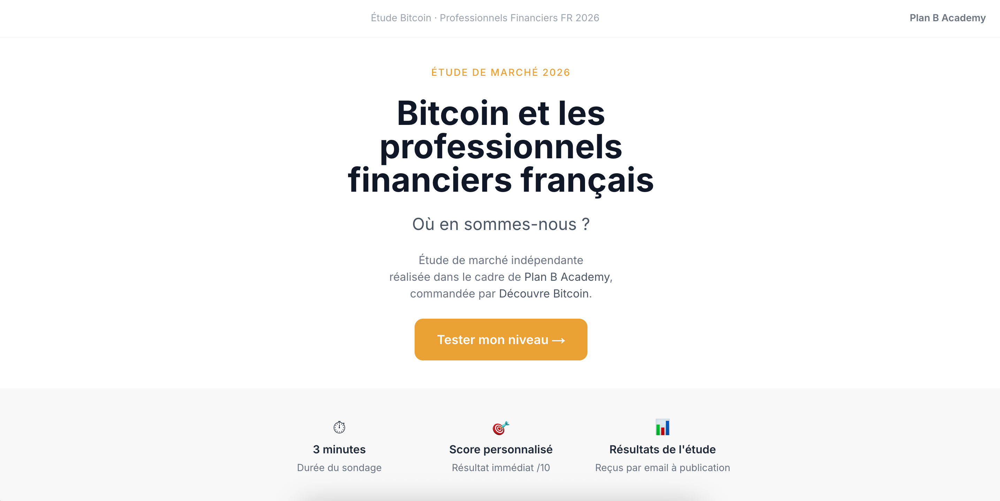
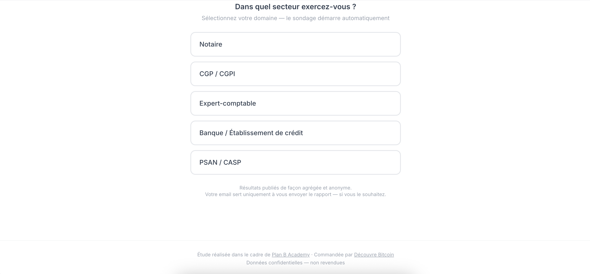
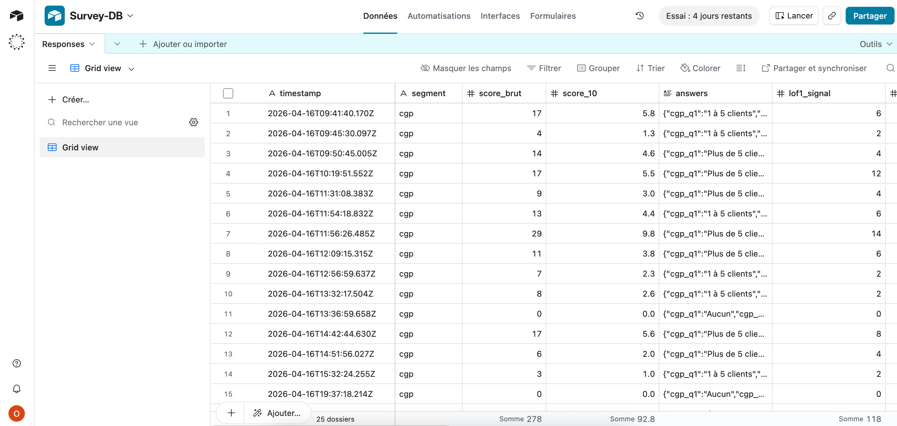

# Sondage d'auto-évaluation — méthodologie et accès

*Outil complémentaire développé en parallèle de la Phase A terrain. Site déployé et accessible publiquement, résultats à la date du rendu insuffisants pour publication statistique. Méthodologie, architecture et accès documentés pour traçabilité et audit.*

---

## Accès direct

**URL publique du sondage** : [marketresearch.orangepeel.fr](https://marketresearch.orangepeel.fr/)

Durée d'un test : environ 3 minutes · Score personnalisé /10 affiché immédiatement · Résultats agrégés de l'étude envoyés par email à publication (si email renseigné).

---

## Objectif

Triangulation **terrain × self-declaration** : mesurer le niveau de maturité Bitcoin auto-déclaré des professionnels financiers sur 5 segments cibles, en complément des 8 entretiens qualitatifs de la Phase A, pour :

- Valider ou nuancer les signaux qualitatifs terrain sur un volume plus large
- Capter des signaux d'urgence réglementaire auto-déclarés (MiCA · DAC8 · ANC 2026-01)
- Établir un baseline de maturité par segment exploitable en Phases B et C

---

## Structure

Cinq segments couverts, sélection en une étape avant démarrage automatique :

| Segment | Nombre de questions | Score max |
|---|:-:|:-:|
| Notaire | 9–11 | 30 |
| CGP / CGPI | 9–11 | 30 |
| Expert-comptable | 9–11 | 30 |
| Banque / Établissement de crédit | 9–11 | 30 |
| PSAN / CASP | 9–11 | 30 |

Score normalisé sur 10 (`SCORE_MAX_BY_SEGMENT` calculé dynamiquement, jamais hardcodé).

---

## Architecture technique

- **Frontend** : Next.js (App Router) · déploiement sous-domaine `marketresearch.orangepeel.fr`
- **Backend données** : Airtable (base `Survey-DB`, table `responses`)
- **Email** : Brevo (envoi conditionnel à publication du rapport)
- **Scoring** : logique `src/lib/scoring.ts` — fonction `calculateScore(answers, segment)` → score /10
- **Signaux LOF** : dérivés via `src/lib/airtable.ts::computeLofSignals()` (LOF1 · LOF2 · LOF5)

Code source : [/02_Sondage/ sur GitHub](https://github.com/man-orangepeel/DB-B2B-GTM-Strategy-2026/tree/main/02_Sondage).

---

## Méthodologie

### Criterion types couverts (9 catégories)

`questions_recues` · `experience_crypto` · `a_laise` · `formation` · `mica_adapte` · `reaction_client` · `dossier_traite` · `pret_payer` · `lof_info`

### Règle de scoring

Le score mesure la **maturité du répondant** (0 à 10), pas un signal GTM direct. Exemple : une réponse « je décline les missions crypto » compte pour 1 point de maturité faible, mais génère séparément un signal GTM « besoin de formation » stocké dans le champ `reaction_client_signal`.

### Contrôle qualité appliqué

- Aucun score hardcodé — `SCORE_MAX_BY_SEGMENT` recalculé à la volée
- Question sur l'expérience crypto restreinte aux actions passées (achat · vente · transfert · théorique), pas de possession personnelle actuelle
- Réordonnancement des questions par segment pour éviter l'effet d'anchor (logique G5 dans `src/app/survey/page.tsx`)

---

## Résultats à la date du rendu

**Volume insuffisant pour publication statistique** au moment de la remise du rapport (avril 2026).

### État agrégé observé

- 25+ réponses collectées sur le segment CGP (majoritaire)
- Autres segments : volumes très faibles
- Distribution limitée au réseau personnel MP + cercle LinkedIn → biais d'échantillon fort
- Taux de complétion variable selon segment

### Pourquoi le rapport ne s'appuie pas dessus

Les conclusions du rapport reposent exclusivement sur :

- Les 8 entretiens qualitatifs Phase A (signaux convergents de praticiens identifiés)
- Le desk research sourcé (réglementation, statistiques officielles, cartographie concurrentielle)

Le sondage reste ouvert et actif post-remise. Une exploitation statistique pourra être envisagée une fois un volume suffisant atteint par segment.

---

## Accès lecteurs et auditeurs

| Accès | Lien |
|---|---|
| Tester le sondage (reproduction du parcours utilisateur) | [marketresearch.orangepeel.fr](https://marketresearch.orangepeel.fr/) |
| Code source complet (Next.js · scoring · schéma Airtable) | [/02_Sondage/ sur GitHub](https://github.com/man-orangepeel/DB-B2B-GTM-Strategy-2026/tree/main/02_Sondage) |
| Vue Airtable en lecture (réponses anonymisées) | Sur demande à [mproquin.perso@gmail.com](mailto:mproquin.perso@gmail.com) |

---

*Retour au [Rapport](./Report.md) · [Sources & Interview Index](./Appendix_2_Sources_Index.md)*
